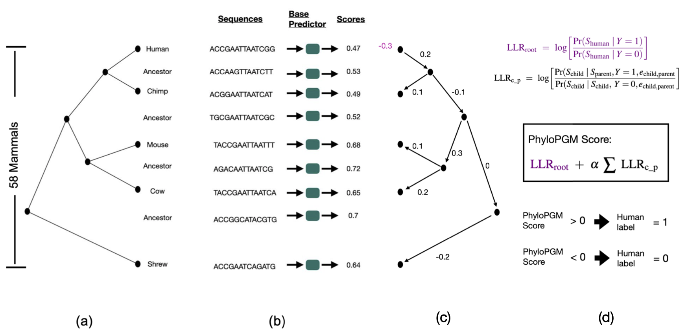

# PhyloPGM

## Requirements
`pip install -r requirements.txt`

## TFBS Prediction Problem
The goal is to improve the prediction accuracy of a previously trained TFBS predictor on human using orthologous data.

### Data Preparation
1. Download data for "within-cell type" problem of ENCODE-DREAM in vivo Transcription Factor Binding Site Prediction Challenge
   https://www.synapse.org/#!Synapse:syn6131484/wiki/402026

2. There should be 13 ChIP-Seq data consisting of 12 TFs and 3 cell types.
3. In train set, sub-sample the number of non-binding sites as the same number of binding sites.
4. Keep 20% of train set as validation set.
5. The input examples in train, validation and test sets are 200 bps, kindly extend each example from both sides to make an input example of 1000 bps.
6. Train FactorNet on the training set and use valdiation set to avoid overfitting.
7. Now, we need to compute orthologous regions to make predictions on orthologous regions using the trained base models
8. The 13 ChIP-Seq data from ENCODE-DREAM competition is based on hg19 human reference, so first convert them to hg38 human reference using liftOver tool
9. Use mafsInRegion program (https://hgdownload.soe.ucsc.edu/admin/exe/linux.x86_64/mafsInRegion) to extract orthologous regions from a 100-way vertebrate whole-genome alignment available from the UCSC Genome browser (Kent et. al. 2002) and computationally predicted ancestral sequences produced by Ancestor1.0 (Diallo et. al. 2009)
10. Ignore orthologous regions whose length is less than 700 bps
11. Symmetrically trim or extend orthologous regions to make input example of 1000 bp.

### Train FactorNet
We can use the script `train_factornet.py` to train a FactorNet model. Below is an example to run the script

`python FactorNet/train_factornet.py toy-data/chipseq-ortho-test.csv toy-data/chipseq-ortho-test.csv toy-data/chipseq-ortho-test.csv  2 10 toy-data/model-trial.pth`

### FactorNet Predictions
The trained FactorNet models can be used to predict on orthologous regions. We need to predict on the orthologous regions of the validation and test sets, which are later used in the PhyloPGM pipeline.

Below is an example of predicting on the orthologous regions of the validation set

`python FactorNet/predict_factornet.py toy-data/chipseq-ortho-val.csv toy-data/model-human-FOXA1.pth toy-data/pred-chipseq-ortho-val.csv`

Below is an example of predicting on the orthologous regions of the test set

`python FactorNet/predict_factornet.py toy-data/chipseq-ortho-test.csv toy-data/model-human-FOXA1.pth toy-data/pred-chipseq-ortho-test.csv`

### Compute PhyloPGM Scores
We need to prepare input for the PhyloPGM computations.

Below is an example to prepare input for PhyloPGM from the predictions made on the orthologous regions of the validation set

`python PhyloPGM/create_PhyloPGM_input.py toy-data/pred-chipseq-ortho-val.csv toy-data/df-pred-chipseq-ortho-val.csv PhyloPGM/tree.pkl 1000`

Below is an example to prepare input for PhyloPGM from the predictions made on the orthologous regions of the test set

`python PhyloPGM/create_PhyloPGM_input.py toy-data/pred-chipseq-ortho-test.csv toy-data/df-pred-chipseq-ortho-test.csv PhyloPGM/tree.pkl 1000`

Now, we can run PhyloPGM script to compute the final PhyloPGM predictions. Below is an example of running PhyloPGM script

`python PhyloPGM/run_PhyloPGM.py toy-data/df-pred-chipseq-ortho-val.csv toy-data/df-pred-chipseq-ortho-test.csv PhyloPGM/tree.pkl toy-data/df-pgm-100`

### Compute PhyloStackNN Scores
PhyloPGM combines the orthologous prediction scores to improve the prediction accuracy on human. Alternatively, We can stack a multilayer perceptron on the orthologous prediction scores to obtain a combined prediction. Below is an example of training such a model. 

`python PhyloStackNN/run_phylostacknn.py --validate-data toy-data/df-pred-chipseq-ortho-val.csv  --test-data toy-data/df-pred-chipseq-ortho-test.csv --output-fname toy-data/df-chipseq-stack.csv`

## RNA-RBP Binding Prediction Problem

### Data Preparation

### Train RNATracker

### RNATracker Predictions
`python RNATracker/predict_rnatracker.py toy-data/ortho-val-100 toy-data/base_model.pth toy-data/pred-ortho-val-100`

`python RNATracker/predict_rnatracker.py toy-data/ortho-test-100 toy-data/base_model.pth toy-data/pred-ortho-test-100`

### Compute PhyloPGM Scores
`python PhyloPGM/create_PhyloPGM_input.py toy-data/pred-ortho-val-100 toy-data/df-pred-ortho-val-100 PhyloPGM/tree.pkl 1000`

`python PhyloPGM/create_PhyloPGM_input.py toy-data/pred-ortho-test-100 toy-data/df-pred-ortho-test-100 PhyloPGM/tree.pkl 1000`

`python PhyloPGM/run_PhyloPGM.py toy-data/df-pred-ortho-val-100 toy-data/df-pred-ortho-test-100 PhyloPGM/tree.pkl toy-data/df-clipseq-pgm-100`

### Compute PhyloStackNN Scores
`python PhyloStackNN/run_phylostacknn.py --validate-data toy-data/df-pred-ortho-val-100  --test-data toy-data/df-pred-ortho-test-100 --output-fname toy-data/df-clipseq-stack.csv`

## Putative Functional Sites Analysis

